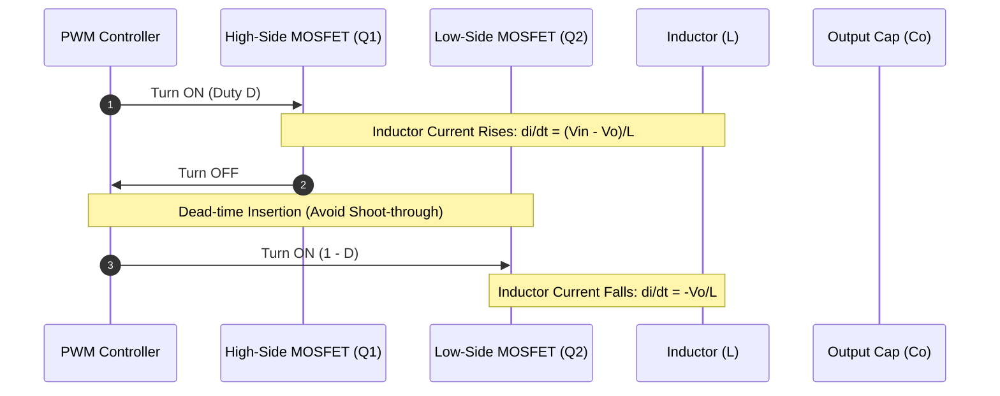

# Advanced STEM & Engineering Showcase

A comprehensive demonstration of Lucid for macOS handling advanced mathematics, theoretical physics, chemistry (`mhchem`), electrical control systems, power electronics, and embedded systems.

---

## 1. Chemistry & Battery Electrochemistry (`\ce{...}`)

Lucid natively renders complex chemical reactions, stoichiometry, oxidation states, and isotopic decay using the embedded `mhchem` engine:

### 1.1 Lithium-Ion Battery Electrochemistry
During charging and discharging, lithium ions intercalate between the cathode and anode:

$$
\ce{LiCoO2 + 6C <=>[\text{charge}][\text{discharge}] Li_{1-x}CoO2 + Li_x C6}
$$

Anode half-reaction:
$$
\ce{C6 + x Li+ + x e- <=> Li_x C6} \quad (E^\circ \approx 0.1 \text{ V vs. Li/Li}^+)
$$

Cathode half-reaction:
$$
\ce{LiCoO2 <=> Li_{1-x}CoO2 + x Li+ + x e-} \quad (E^\circ \approx 3.9 \text{ V vs. Li/Li}^+)
$$

### 1.2 Stoichiometric & Redox Reactions
- **Haber-Bosch Synthesis**: $\ce{N2 + 3H2 <=>[Fe][\Delta, P] 2NH3} \quad \Delta H^\circ = -92.4 \text{ kJ/mol}$
- **Precipitation**: $\ce{Ag+ (aq) + Cl- (aq) -> AgCl (s) v}$
- **Alpha Decay of Uranium**: $\ce{^{238}_{92}U -> ^{234}_{90}Th + ^{4}_{2}\alpha}$

---

## 2. Theoretical Physics & Mathematics

### 2.1 Maxwell's Equations in Differential and Integral Forms

| Differential Form | Integral Form | Physical Law |
| :--- | :--- | :--- |
| $\nabla \cdot \mathbf{E} = \frac{\rho}{\varepsilon_0}$ | $\oint_{\partial V} \mathbf{E} \cdot d\mathbf{A} = \frac{Q_{enc}}{\varepsilon_0}$ | Gauss's Law |
| $\nabla \cdot \mathbf{B} = 0$ | $\oint_{\partial V} \mathbf{B} \cdot d\mathbf{A} = 0$ | Gauss's Law for Magnetism |
| $\nabla \times \mathbf{E} = -\frac{\partial \mathbf{B}}{\partial t}$ | $\oint_{\partial \Sigma} \mathbf{E} \cdot d\mathbf{l} = -\frac{d\Phi_B}{dt}$ | Faraday's Law of Induction |
| $\nabla \times \mathbf{B} = \mu_0 \mathbf{J} + \mu_0 \varepsilon_0 \frac{\partial \mathbf{E}}{\partial t}$ | $\oint_{\partial \Sigma} \mathbf{B} \cdot d\mathbf{l} = \mu_0 I_{enc} + \mu_0 \varepsilon_0 \frac{d\Phi_E}{dt}$ | Ampère-Maxwell Law |

### 2.2 Quantum Mechanics & Dirac Notation
The time-dependent Schrödinger equation in Hamiltonian operator formulation:

$$
i\hbar \frac{\partial}{\partial t} \ket{\Psi(t)} = \hat{H} \ket{\Psi(t)}
$$

Expectation value of an observable $\hat{A}$ for state $\ket{\psi}$:

$$
\langle A \rangle = \frac{\bra{\psi}\hat{A}\ket{\psi}}{\braket{\psi|\psi}}
$$

---

## 3. Control Systems Engineering

### 3.1 Closed-Loop Feedback Control System


### 3.2 State-Space Representation
For a continuous-time Linear Time-Invariant (LTI) system with $n$ states, $m$ inputs, and $p$ outputs:

$$
\begin{aligned}
\dot{\mathbf{x}}(t) &= \mathbf{A}\mathbf{x}(t) + \mathbf{B}\mathbf{u}(t) \\
\mathbf{y}(t) &= \mathbf{C}\mathbf{x}(t) + \mathbf{D}\mathbf{u}(t)
\end{aligned}
$$

The system transfer function matrix is given by:

$$
\mathbf{G}(s) = \mathbf{C}(s\mathbf{I} - \mathbf{A})^{-1}\mathbf{B} + \mathbf{D}
$$

> [!EXAMPLE]- Step-by-Step Derivation of Closed-Loop Transfer Function
> Taking the Laplace transform of the state-space equations with zero initial conditions:
> $$s\mathbf{X}(s) = \mathbf{A}\mathbf{X}(s) + \mathbf{B}\mathbf{U}(s)$$
> $$(s\mathbf{I} - \mathbf{A})\mathbf{X}(s) = \mathbf{B}\mathbf{U}(s)$$
> $$\mathbf{X}(s) = (s\mathbf{I} - \mathbf{A})^{-1}\mathbf{B}\mathbf{U}(s)$$
> Substituting into $\mathbf{Y}(s) = \mathbf{C}\mathbf{X}(s) + \mathbf{D}\mathbf{U}(s)$ yields $\mathbf{G}(s)$.

---

## 4. Power Electronics & Conversion

### 4.1 Synchronous Buck Converter Dynamics



### 4.2 Key Inverter & Converter Formulas
- **Buck Output Voltage**: $V_o = D \cdot V_{in}$
- **Boost Output Voltage**: $V_o = \frac{V_{in}}{1 - D}$
- **Critical Inductance (CCM Mode)**:
  $$
  L_{crit} = \frac{(1 - D) R}{2 f_{sw}}
  $$
- **Inductor Ripple Current**:
  $$
  \Delta I_L = \frac{V_{in} - V_o}{L} \cdot D T_s = \frac{V_o (1 - D)}{L f_{sw}}
  $$

---

## 5. Code Implementations & Algorithms

### 5.1 Python: Digital State-Feedback Simulation
```python
import numpy as np
from scipy import signal

# State-Space System Matrices
A = np.array([[0, 1], [-2, -3]])
B = np.array([[0], [1]])
C = np.array([[1, 0]])
D = np.array([[0]])

# Desired Closed-Loop Pole Locations
desired_poles = np.array([-2.0 + 2.0j, -2.0 - 2.0j])
K = signal.place_poles(A, B, desired_poles).gain_matrix

print(f"Computed State-Feedback Gain K: {K}")
```

### 5.2 MATLAB: Bode Plot & Gain/Phase Margin
```matlab
% Plant Transfer Function
s = tf('s');
G = 100 / (s^3 + 10*s^2 + 31*s + 30);

% PID Controller
Kp = 2.5; Ki = 1.2; Kd = 0.4;
C = Kp + Ki/s + Kd*s / (1 + 0.01*s);

% Closed-Loop System Analysis
L = C * G;
[Gm, Pm, Wcg, Wcp] = margin(L);
fprintf('Gain Margin: %.2f dB, Phase Margin: %.2f deg\n', 20*log10(Gm), Pm);
```

### 5.3 C++: Discrete Field-Oriented Control (FOC) Loop
```cpp
struct FOCController {
    float kp_d, ki_d, kp_q, ki_q;
    float integral_d = 0.0f;
    float integral_q = 0.0f;

    void update(float id_ref, float iq_ref, float id_meas, float iq_meas, float dt, float &vd_out, float &vq_out) {
        float err_d = id_ref - id_meas;
        float err_q = iq_ref - iq_meas;

        integral_d += err_d * dt;
        integral_q += err_q * dt;

        vd_out = kp_d * err_d + ki_d * integral_d;
        vq_out = kp_q * err_q + ki_q * integral_q;
    }
};
```

---

## 6. References & Footnotes

Engineering documents frequently require citations[^1] and mathematical references[^2]. Hover your mouse cursor over the footnote numbers above to preview them directly without jumping.

[^1]: Erickson, R. W., & Maksimovic, D. (2020). *Fundamentals of Power Electronics* (3rd ed.). Springer.
[^2]: Ogata, K. (2010). *Modern Control Engineering* (5th ed.). Prentice Hall.
