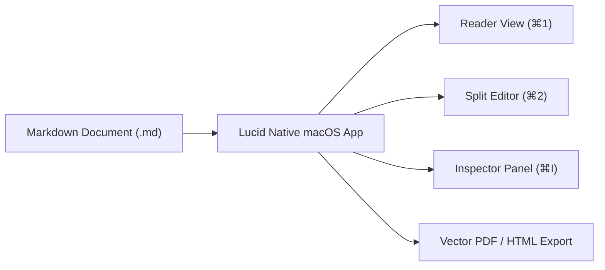

# Welcome to Lucid for macOS

Lucid is a distraction-free, high-performance Markdown reader and editor built natively for macOS.

## GitHub Alerts

> [!NOTE]
> This is a standard informational callout with Lucid's custom iconography and accent border.

> [!TIP]
> Use `⌘1` for Reader Mode, `⌘2` for Split View, and `⌘3` for Editor Mode. Press `⌘I` to open the Inspector.

> [!IMPORTANT]
> The app monitors external changes live: edit this file in Neovim, VS Code, or Obsidian and watch Lucid update instantly.

> [!WARNING]
> Ensure you save your work before closing unsaved documents.

> [!CAUTION]
> Deleting this document cannot be undone.

---

## Typography & Extended Syntax

Lucid supports rich Markdown extensions out of the box:
- **Highlighting**: ==This text is highlighted==
- **Subscript & Superscript**: H~2~O and E = mc^2^
- **Inserted text**: ++New inserted text++
- **Task Lists**:
  - [x] Native Swift 6 Apple Silicon binary
  - [x] Offline KaTeX and Mermaid rendering
  - [x] Vector PDF and standalone HTML export
  - [ ] Publish to Mac App Store / Homebrew Cask

---

## KaTeX Equations

Inline math: The Gaussian integral is $\int_{-\infty}^{\infty} e^{-x^2} dx = \sqrt{\pi}$.

Block math:

$$
\mathcal{L}\{\dot{x}(t)\} = s X(s) - x(0)
$$

$$
\nabla \times \mathbf{B} = \mu_0 \mathbf{J} + \mu_0 \varepsilon_0 \frac{\partial \mathbf{E}}{\partial t}
$$

---

## Mermaid Diagram

---

## Data Table (Breakout Layout)

| Feature | Lucid Native macOS | Typical Electron App |
| :--- | :---: | :---: |
| **Launch Time** | **< 50 ms** | 1,500 – 3,000 ms |
| **Memory Usage** | **~25 MB** | 250 – 500 MB |
| **App Size** | **8.9 MB** | 180 – 300 MB |
| **ProMotion 120Hz** | **Native** | Simulated / Throttled |
| **System Vibrancy** | **True NSVisualEffectView** | CSS backdrop-filter |
