# Control Systems — Unit 1 & Unit 2 Beginner Notes
### B.E. Electrical Engineering — 5th Semester  
### Mid-Term Notes (Beginner Friendly + Mermaid Diagrams)

> **Syllabus covered**
>
> **Mathematical Models:** Representation of simple physical open-loop and closed-loop systems, Electrical analogue, Block diagrams, Block diagram reduction techniques, Signal flow diagram, Mason's gain formula.
>
> **Control Systems Components:** Error detectors, Potentiometers, Synchro, Servo amplifiers, D.C. servo motors, A.C. servo motors.

---

# How to use these notes

These notes are written in a **very simple way**, assuming you are a **beginner**.

In every topic I try to explain:
1. **What it is**
2. **Why it is used**
3. **Main formula**
4. **Easy understanding**
5. **Mermaid diagram** wherever useful

> **Important:**  
> To see Mermaid diagrams in VS Code properly, use a Markdown preview extension that supports Mermaid, or open preview where Mermaid is enabled.

---

# UNIT 1 — MATHEMATICAL MODELS

---

# 1. What is a Control System?

A **control system** is a system that controls the output according to our requirement.

### Simple idea
We give some **input**, the system processes it, and we get an **output**.

### Example
- You want a room temperature of **25°C**
- AC works to maintain that temperature
- This is a control system

---

## Basic terms

- **Input / Reference input**: What we want
- **Output**: What we get
- **Error**: Difference between desired output and actual output
- **Controller**: Takes action to reduce error
- **Plant**: Main system to be controlled
- **Feedback**: Sending output information back for comparison

---

## Basic control-system idea

```mermaid
flowchart LR
    A[Reference Input r(t)] --> B[Controller]
    B --> C[Plant / Process]
    C --> D[Output c(t)]
```

---

# 2. Open-Loop Control System

## Definition
An **open-loop control system** is one in which the output is **not checked** or **not fed back** to the input.

### Easy meaning
System works only on the basis of input command.  
It does **not care** whether the output is correct or not.

---

## Open-loop diagram

```mermaid
flowchart LR
    A[Input R(s)] --> B[Controller Gc(s)]
    B --> C[Plant Gp(s)]
    C --> D[Output C(s)]
```

If total forward transfer function is

$$
G(s)=G_c(s)G_p(s)
$$

then

$$
\frac{C(s)}{R(s)} = G(s)
$$

---

## Examples
- Toaster with fixed timer
- Washing machine with fixed timing
- Traffic lights with preset timing

---

## Advantages
- Simple
- Cheap
- Easy to design
- Fast

## Disadvantages
- Less accurate
- Cannot correct error automatically
- Disturbances affect output

---

# 3. Closed-Loop Control System

## Definition
A **closed-loop control system** is one in which output is measured and compared with input, and the difference is used to control the system.

### Easy meaning
System keeps checking:
> “Am I giving the correct output?”

If not, it corrects itself.

---

## Closed-loop diagram

```mermaid
flowchart LR
    A[Reference Input R(s)] --> B((Σ))
    B --> C[Forward Path G(s)]
    C --> D[Output C(s)]
    D --> E[Feedback H(s)]
    E --> B
```

At the summing point:

$$
E(s)=R(s)-B(s)
$$

and

$$
B(s)=H(s)C(s)
$$

Also,

$$
C(s)=G(s)E(s)
$$

Substituting:

$$
C(s)=G(s)[R(s)-H(s)C(s)]
$$

So,

$$
\frac{C(s)}{R(s)}=\frac{G(s)}{1+G(s)H(s)}
$$

---

## For negative feedback

$$
\boxed{
\frac{C(s)}{R(s)}
=
\frac{G(s)}{1+G(s)H(s)}
}
$$

## For positive feedback

$$
\boxed{
\frac{C(s)}{R(s)}
=
\frac{G(s)}{1-G(s)H(s)}
}
$$

---

## Examples
- Automatic voltage regulator
- Speed control of motor
- AC temperature control
- Servo position control

---

## Advantages
- More accurate
- Error reduces automatically
- Better performance
- Less sensitive to disturbance

## Disadvantages
- More complex
- More expensive
- Stability problems may occur

---

# 4. Open Loop vs Closed Loop

| Point | Open Loop | Closed Loop |
|---|---|---|
| Feedback | No | Yes |
| Accuracy | Low | High |
| Error correction | No | Yes |
| Complexity | Less | More |
| Cost | Low | Higher |
| Reliability under disturbance | Less | Better |

---

## Quick visual comparison

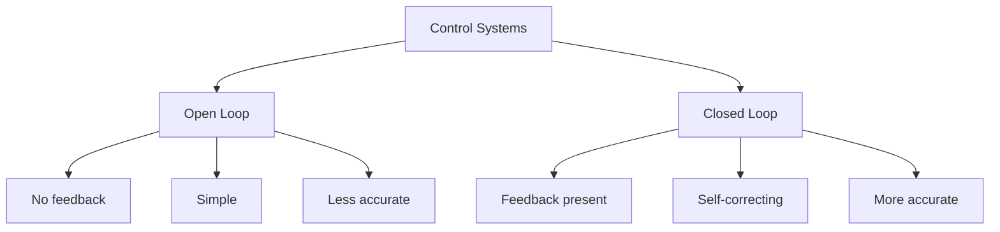

---

# 5. Mathematical Model

## What is it?
A **mathematical model** is the mathematical representation of a physical system.

### Why do we need it?
Because once the system is written as equations, we can:
- Analyze it
- Solve it
- Find transfer function
- Predict behavior

---

## General steps of modelling


---

# 6. Transfer Function

## Definition
The **transfer function** is the ratio of Laplace transform of output to Laplace transform of input, assuming initial conditions are zero.

$$
\boxed{
G(s)=\frac{C(s)}{R(s)}
}
$$

## Important points
- Used for linear time-invariant systems
- Initial conditions are zero
- Gives input-output relation
- Very important in control systems

---

# 7. Mechanical Translational Systems

These are systems where motion is in a **straight line**.

Main elements:
- **Mass** \(M\)
- **Damper** \(B\)
- **Spring** \(K\)

---

## 7.1 Mass element

From Newton’s law:

$$
F(t)=M\frac{d^2x(t)}{dt^2}
$$

Taking Laplace transform:

$$
F(s)=Ms^2X(s)
$$

So,

$$
\frac{X(s)}{F(s)}=\frac{1}{Ms^2}
$$

---

## 7.2 Damper element

For a damper:

$$
F(t)=B\frac{dx(t)}{dt}
$$

Laplace form:

$$
F(s)=BsX(s)
$$

So,

$$
\frac{X(s)}{F(s)}=\frac{1}{Bs}
$$

---

## 7.3 Spring element

For a spring:

$$
F(t)=Kx(t)
$$

Laplace form:

$$
F(s)=KX(s)
$$

So,

$$
\frac{X(s)}{F(s)}=\frac{1}{K}
$$

---

## Translational mechanical system diagram

```mermaid
flowchart LR
    A[Applied Force F(t)] --> B[Mass M]
    B --> C[Damper B]
    C --> D[Spring K]
    D --> E[Displacement x(t)]
```

---

# 8. Mass-Spring-Damper System

This is the most common mechanical model.

## Equation

$$
F(t)=M\frac{d^2x}{dt^2}+B\frac{dx}{dt}+Kx
$$

Taking Laplace transform:

$$
F(s)=(Ms^2+Bs+K)X(s)
$$

Therefore,

$$
\boxed{
\frac{X(s)}{F(s)}=\frac{1}{Ms^2+Bs+K}
}
$$

### Easy understanding
- \(M\) opposes acceleration
- \(B\) opposes speed
- \(K\) opposes displacement

---

## Visual idea

```mermaid
flowchart LR
    A[Force F(t)] --> B[Mass M]
    B --> C[Damper B]
    B --> D[Spring K]
    C --> E[Displacement x(t)]
    D --> E
```

---

# 9. Mechanical Rotational Systems

These systems rotate instead of moving in a straight line.

Main elements:
- **Moment of inertia** \(J\)
- **Rotational damping** \(B\)
- **Torsional spring constant** \(K\)

---

## Rotational quantities comparison

| Translational | Rotational |
|---|---|
| Force \(F\) | Torque \(T\) |
| Mass \(M\) | Inertia \(J\) |
| Displacement \(x\) | Angular displacement \(\theta\) |
| Velocity \(\dot{x}\) | Angular velocity \(\dot{\theta}\) |

---

## Rotational equation

$$
T(t)=J\frac{d^2\theta}{dt^2}+B\frac{d\theta}{dt}+K\theta
$$

Taking Laplace transform:

$$
T(s)=(Js^2+Bs+K)\Theta(s)
$$

So,

$$
\boxed{
\frac{\Theta(s)}{T(s)}=\frac{1}{Js^2+Bs+K}
}
$$

---

## Rotational system diagram

```mermaid
flowchart LR
    A[Torque T(t)] --> B[Inertia J]
    B --> C[Damping B]
    B --> D[Spring K]
    C --> E[Angular Output θ(t)]
    D --> E
```

---

# 10. Electrical Systems

In control systems, electrical circuits are also modeled mathematically.

Main elements:
- Resistance \(R\)
- Inductance \(L\)
- Capacitance \(C\)

---

# 11. RC Circuit

If output is capacitor voltage:

$$
\frac{V_o(s)}{V_i(s)}=\frac{1}{RCs+1}
$$

This is a **first-order system**.

---

## RC circuit idea


---

# 12. RL Circuit

If output is resistor voltage:

$$
\frac{V_o(s)}{V_i(s)}=\frac{R}{Ls+R}
$$

---

# 13. RLC Circuit

For a series RLC circuit:

$$
V(s)=\left(R+Ls+\frac{1}{Cs}\right)I(s)
$$

So,

$$
\frac{I(s)}{V(s)}=
\frac{1}{R+Ls+\frac{1}{Cs}}
$$

or

$$
\frac{I(s)}{V(s)}=
\frac{Cs}{LCs^2+RCs+1}
$$

---

# 14. Electrical Analogy

## What is electrical analogy?
Sometimes a mechanical system is difficult to analyze directly.  
So we convert it into an equivalent electrical circuit.

This is called **electrical analogy**.

There are two types:
1. Force-Voltage Analogy
2. Force-Current Analogy

---

# 15. Force-Voltage Analogy

Also called **impedance analogy**.

## Comparison table

| Mechanical | Electrical |
|---|---|
| Force \(F\) | Voltage \(V\) |
| Velocity \(v\) | Current \(i\) |
| Displacement \(x\) | Charge \(q\) |
| Mass \(M\) | Inductance \(L\) |
| Damping \(B\) | Resistance \(R\) |
| Spring constant \(K\) | \(1/C\) |

---

## Easy memory trick
- **Force → Voltage**
- **Mass → Inductance**
- **Damper → Resistance**
- **Spring → Reciprocal of capacitance**

---

## Mermaid memory map

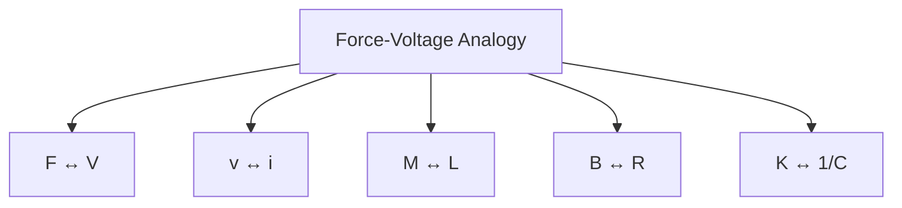

---

# 16. Force-Current Analogy

Also called **mobility analogy**.

## Comparison table

| Mechanical | Electrical |
|---|---|
| Force \(F\) | Current \(I\) |
| Velocity \(v\) | Voltage \(V\) |
| Mass \(M\) | Capacitance \(C\) |
| Damping \(B\) | \(1/R\) |
| Spring constant \(K\) | \(1/L\) |

---

## Mermaid memory map

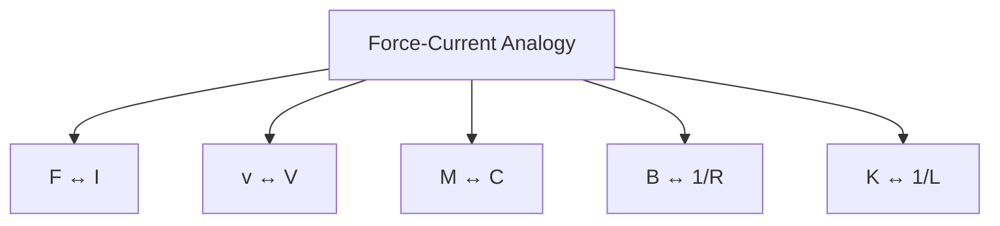

---

# 17. Block Diagram

## What is a block diagram?
A block diagram is a simple graphical method to show how different parts of a control system are connected.

---

## Basic block

```mermaid
flowchart LR
    A[Input X(s)] --> B[Block G(s)]
    B --> C[Output Y(s)]
```

Relation:

$$
Y(s)=G(s)X(s)
$$

---

## Summing point

Used to add or subtract signals.

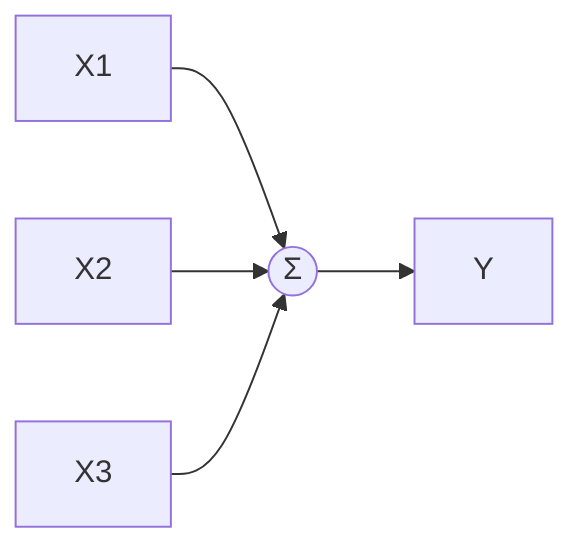

---

## Take-off point

Used to split the same signal into more than one path.

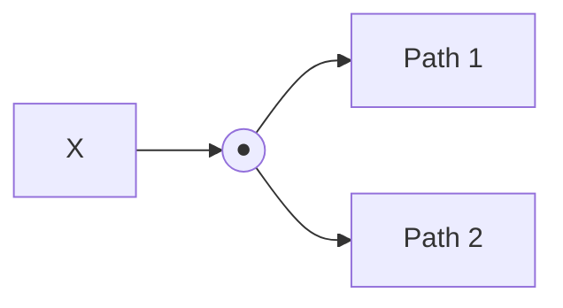

---

# 18. Block Diagram Reduction Techniques

Goal: make a complex block diagram into one single transfer function.

---

## 18.1 Series blocks

If blocks are connected one after another:

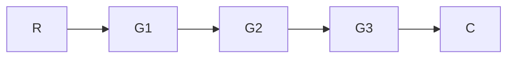

Equivalent transfer function:

$$
G_{eq}=G_1G_2G_3
$$

---

## 18.2 Parallel blocks

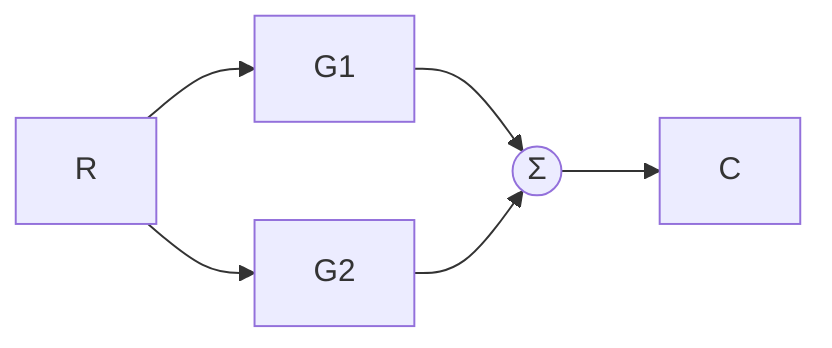

Equivalent transfer function:

$$
G_{eq}=G_1+G_2
$$

If one branch is subtractive, then:

$$
G_{eq}=G_1-G_2
$$

---

## 18.3 Feedback blocks

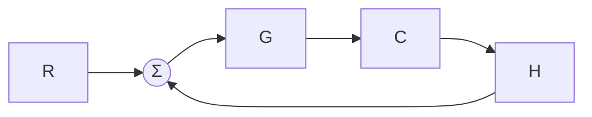

For negative feedback:

$$
\frac{C(s)}{R(s)}=\frac{G}{1+GH}
$$

For positive feedback:

$$
\frac{C(s)}{R(s)}=\frac{G}{1-GH}
$$

---

# 19. Important Shifting Rules

These are asked often in theory and problems.

---

## 19.1 Moving a summing point after a block

If summing point moves **after** a block \(G\), then side signal is multiplied by \(G\).

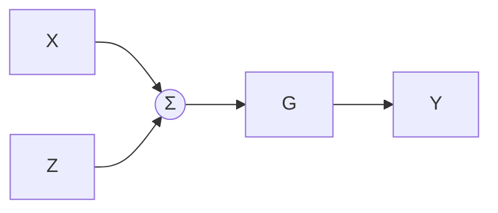

becomes conceptually:

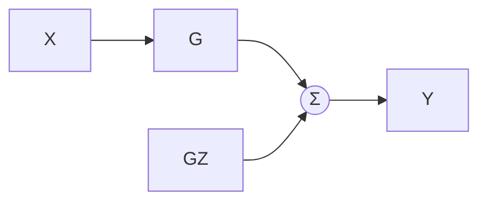

---

## 19.2 Moving a summing point before a block

If summing point moves **before** a block, divide side signal by \(G\).

---

## 19.3 Moving a take-off point after a block

If take-off point moves after a block, use \(1/G\) in the side branch.

---

## 19.4 Moving a take-off point before a block

If take-off point moves before a block, use \(G\) in the side branch.

---

# 20. Simple strategy for block diagram reduction

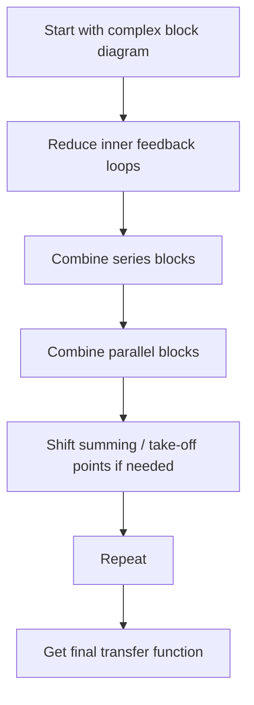

---

# 21. Signal Flow Graph (SFG)

## What is it?
A **signal flow graph** is another graphical method to represent equations of a control system.

Instead of blocks, it uses:
- **Nodes**
- **Branches**
- **Branch gains**

---

## Important terms

- **Node**: A variable
- **Branch**: Directed line between nodes
- **Branch gain**: Multiplier on branch
- **Forward path**: Path from input to output
- **Loop**: Closed path
- **Non-touching loops**: Loops that do not share any node

---

## Example of signal flow graph

```mermaid
flowchart LR
    A[x1] -->|a| B[x2]
    C[x3] -->|b| B
```

This represents:

$$
x_2=ax_1+bx_3
$$

---

# 22. Signal Flow Graph Example Structure

```mermaid
flowchart LR
    A[R] -->|G1| B[X1]
    B -->|G2| C[X2]
    C -->|G3| D[C]
    C -->|H1| B
    D -->|H2| A
```

This kind of graph can have:
- forward paths
- loops
- feedback branches

---

# 23. Mason’s Gain Formula

This formula is used to find transfer function directly from signal flow graph.

## Formula

$$
\boxed{
T=\frac{C(s)}{R(s)}=\frac{\sum P_k\Delta_k}{\Delta}
}
$$

Where:

- \(P_k\) = gain of \(k^{th}\) forward path
- \(\Delta\) = determinant of graph
- \(\Delta_k\) = determinant after removing loops touching the \(k^{th}\) forward path

---

## Formula for \(\Delta\)

$$
\Delta
=
1
-
(\text{sum of individual loop gains})
+
(\text{sum of products of two non-touching loops})
-
(\text{sum of products of three non-touching loops})
+\cdots
$$

---

## Easy step-by-step method

```mermaid
flowchart TD
    A[Find all forward paths] --> B[Find gain of each path]
    B --> C[Find all loops]
    C --> D[Find loop gains]
    D --> E[Find non-touching loops]
    E --> F[Calculate Δ]
    F --> G[Find Δk for each forward path]
    G --> H[Apply Mason's formula]
```

---

## Simple example idea

If there is only one forward path \(P_1\) and one loop \(L_1\),

then

$$
\Delta = 1-L_1
$$

and if the loop touches the forward path, then

$$
\Delta_1=1
$$

So,

$$
T=\frac{P_1}{1-L_1}
$$

---

# 24. Block Diagram vs Signal Flow Graph

| Block Diagram | Signal Flow Graph |
|---|---|
| Uses blocks | Uses nodes and branches |
| Easy to understand physically | Easy for mathematical analysis |
| Good for system view | Good for Mason’s formula |
| Reduction may take longer | Direct formula available |

---

# UNIT 2 — CONTROL SYSTEM COMPONENTS

---

# 25. Error Detector

## What is it?
An **error detector** compares the desired input and actual output and gives the difference.

That difference is called **error signal**.

$$
e(t)=r(t)-b(t)
$$

or in Laplace form:

$$
E(s)=R(s)-B(s)
$$

---

## Easy idea
If desired position is 10 units and actual position is 8 units, then

$$
e=10-8=2
$$

So the system knows it still needs correction.

---

## Error detector in system

```mermaid
flowchart LR
    A[Reference Input] --> B((Comparator / Error Detector))
    C[Feedback Signal] --> B
    B --> D[Error Signal e(t)]
```

---

# 26. Potentiometer

## What is it?
A **potentiometer** is an electromechanical device that converts displacement into voltage.

It is used for:
- position sensing
- error detection

---

## Formula

For angular displacement:

$$
V_o=K_p\theta
$$

Where:
- \(V_o\) = output voltage
- \(K_p\) = potentiometer constant
- \(\theta\) = angular displacement

---

## Potentiometer as error detector

If

$$
V_r=K_p\theta_r
$$

and

$$
V_o=K_p\theta_o
$$

then error voltage is:

$$
e=V_r-V_o
$$

So,

$$
\boxed{
e=K_p(\theta_r-\theta_o)
}
$$

---

## Visual idea

```mermaid
flowchart LR
    A[Reference Position θr] --> B[Potentiometer 1]
    C[Actual Position θo] --> D[Potentiometer 2]
    B --> E((Comparator))
    D --> E
    E --> F[Error Voltage e]
```

---

## Advantages
- Simple
- Cheap
- Direct output voltage
- Easy to use

## Disadvantages
- Mechanical wear
- Friction
- Contact noise

---

# 27. Synchro

## What is it?
A **synchro** is a device used to transmit angular position from one place to another electrically.

Used in:
- position control
- servo systems
- aircraft systems
- remote indication systems

---

## Main parts
- Rotor
- Stator

### Rotor
- Single-phase winding
- Supplied with AC voltage

### Stator
- Three windings
- Placed 120° apart

---

## Synchro concept diagram

```mermaid
flowchart LR
    A[AC Supply] --> B[Rotor]
    B --> C[Magnetic Field]
    C --> D[Stator Windings S1 S2 S3]
    D --> E[Position Information]
```

---

# 28. Synchro Transmitter and Receiver

A transmitter sends angle information and the receiver follows that angle.

---

## Simple idea

```mermaid
flowchart LR
    A[Synchro Transmitter] --> B[Electrical Signal]
    B --> C[Synchro Receiver]
    C --> D[Receiver Shaft Position]
```

If transmitter angle changes, receiver angle also changes to match it.

Ideally,

$$
\theta_{receiver}=\theta_{transmitter}
$$

---

# 29. Synchro as an Error Detector

A synchro can also compare two shaft positions and generate an error signal.

If

- \(\theta_r\) = reference angle
- \(\theta_o\) = output angle

Then,

$$
\theta_e=\theta_r-\theta_o
$$

Output of control transformer is approximately:

$$
e(t)=K_s\sin(\theta_r-\theta_o)\sin \omega t
$$

For small angle,

$$
\sin(\theta_r-\theta_o)\approx(\theta_r-\theta_o)
$$

So,

$$
e(t)\approx K_s(\theta_r-\theta_o)\sin \omega t
$$

---

## Visual flow

```mermaid
flowchart LR
    A[Reference Shaft Angle θr] --> B[Synchro Unit]
    C[Output Shaft Angle θo] --> B
    B --> D[AC Error Signal]
```

---

## Advantages
- Good for remote position transmission
- Rugged
- Reliable

## Limitations
- More costly than potentiometer
- Needs AC supply

---

# 30. Servo Amplifier

## What is it?
A **servo amplifier** amplifies a weak error signal so that it can drive a motor.

### Why needed?
The error signal produced by detector is usually very small.  
Motor needs more power.  
So amplifier boosts the signal.

---

## Servo amplifier role

```mermaid
flowchart LR
    A[Error Detector] --> B[Servo Amplifier]
    B --> C[Servo Motor]
    C --> D[Mechanical Output]
```

---

## Main requirements
- High gain
- Fast response
- Good stability
- Good linearity
- Enough output power

---

# 31. D.C. Servo Amplifier

Used when error signal is DC or slowly varying.

## Input-output relation

$$
V_o=K_a e
$$

Where:
- \(V_o\) = amplifier output
- \(K_a\) = gain
- \(e\) = input error signal

---

## Diagram

```mermaid
flowchart LR
    A[DC Error Signal] --> B[DC Servo Amplifier]
    B --> C[DC Servo Motor]
```

---

# 32. A.C. Servo Amplifier

Used when the error signal is AC.

The phase and amplitude of signal are important.

- Magnitude tells how much error
- Phase tells direction of correction

---

## Diagram

```mermaid
flowchart LR
    A[AC Error Signal] --> B[AC Servo Amplifier]
    B --> C[AC Servo Motor]
```

---

# 33. D.C. Servo Motor

## What is it?
A **DC servo motor** is a DC motor used in control systems for precise control of speed or position.

---

## Features
- Fast response
- High torque
- Good control
- Low inertia

---

# 34. Armature-Controlled D.C. Servo Motor

This is the most important DC servo-motor model in control systems.

---

## Electrical equation

$$
V_a(t)=R_ai_a(t)+L_a\frac{di_a(t)}{dt}+e_b(t)
$$

Back emf:

$$
e_b(t)=K_b\omega(t)
$$

Torque:

$$
T_m(t)=K_ti_a(t)
$$

Mechanical equation:

$$
T_m(t)=J\frac{d\omega}{dt}+B\omega
$$

---

## Transfer function

After Laplace transform and simplification:

$$
\boxed{
\frac{\Theta(s)}{V_a(s)}
=
\frac{K_t}
{s[(L_as+R_a)(Js+B)+K_bK_t]}
}
$$

If \(L_a\) is neglected:

$$
\boxed{
\frac{\Theta(s)}{V_a(s)}
=
\frac{K_t}
{s[R_a(Js+B)+K_bK_t]}
}
$$

---

## Speed transfer function

$$
\boxed{
\frac{\Omega(s)}{V_a(s)}
=
\frac{K_t}
{(L_as+R_a)(Js+B)+K_bK_t}
}
$$

---

## Concept diagram

```mermaid
flowchart LR
    A[Armature Voltage Va] --> B[Armature Circuit]
    B --> C[Torque Production]
    C --> D[Mechanical Rotation]
    D --> E[Output θ or ω]
    D --> F[Back EMF Kbω]
    F --> B
```

---

# 35. Field-Controlled D.C. Servo Motor

In this type, field current is controlled.

Field circuit:

$$
V_f(t)=R_fi_f(t)+L_f\frac{di_f(t)}{dt}
$$

Torque is approximately:

$$
T_m=K_fi_f
$$

### Important point
Field-controlled motor is generally **slower** than armature-controlled motor.

---

# 36. Armature Control vs Field Control

| Armature Control | Field Control |
|---|---|
| Armature voltage varied | Field current varied |
| Faster | Slower |
| Commonly used | Less common in fast servo systems |

---

# 37. A.C. Servo Motor

## What is it?
An **AC servo motor** is an AC motor used for control purposes.

Usually it is a **two-phase induction motor**.

---

## Main construction
It has:
- Reference winding
- Control winding
- Rotor

The two windings are 90° apart.

---

## Construction diagram

```mermaid
flowchart TD
    A[AC Servo Motor]
    A --> B[Reference Winding]
    A --> C[Control Winding]
    A --> D[Rotor]
```

---

# 38. Working of A.C. Servo Motor

- Reference winding gets constant AC supply
- Control winding gets control/error signal
- Combined effect produces torque
- Rotor rotates
- Direction depends on phase of control signal

---

## Control concept

```mermaid
flowchart LR
    A[Reference AC Supply] --> B[Reference Winding]
    C[Control Signal] --> D[Control Winding]
    B --> E[Magnetic Interaction]
    D --> E
    E --> F[Motor Torque]
    F --> G[Rotation]
```

---

## Approximate torque equation

$$
T_m=K_1V_c-K_2\omega
$$

Where:
- \(V_c\) = control voltage
- \(\omega\) = angular speed

Mechanical equation:

$$
J\frac{d\omega}{dt}+B\omega=T_m
$$

Substituting:

$$
J\frac{d\omega}{dt}+(B+K_2)\omega=K_1V_c
$$

Taking Laplace transform:

$$
\boxed{
\frac{\Omega(s)}{V_c(s)}=\frac{K_1}{Js+(B+K_2)}
}
$$

and for position:

$$
\boxed{
\frac{\Theta(s)}{V_c(s)}=\frac{K_1}{s[Js+(B+K_2)]}
}
$$

---

# 39. D.C. Servo Motor vs A.C. Servo Motor

| D.C. Servo Motor | A.C. Servo Motor |
|---|---|
| Works on DC | Works on AC |
| Good linearity | Approximate linearity |
| More maintenance | Less maintenance |
| Brushes/commutator possible | Usually no commutator |
| Better speed control | Common in low-power servo applications |

---

# 40. Complete Closed-Loop Servo System

This is a very important system-level idea.

```mermaid
flowchart LR
    A[Desired Position] --> B[Error Detector]
    E[Feedback Position] --> B
    B --> C[Servo Amplifier]
    C --> D[Servo Motor]
    D --> F[Load / Output Position]
    F --> E
```

### Working
1. Desired position is given
2. Error detector compares desired and actual position
3. Error signal is produced
4. Servo amplifier amplifies it
5. Servo motor moves the load
6. Feedback updates continuously
7. Error reduces to zero or near zero

---

# 41. Formula Sheet (Quick Revision)

## Closed-loop transfer function

Negative feedback:

$$
\frac{C(s)}{R(s)}=\frac{G(s)}{1+G(s)H(s)}
$$

Positive feedback:

$$
\frac{C(s)}{R(s)}=\frac{G(s)}{1-G(s)H(s)}
$$

---

## Mechanical translational system

$$
F=M\ddot{x}+B\dot{x}+Kx
$$

$$
\frac{X(s)}{F(s)}=\frac{1}{Ms^2+Bs+K}
$$

---

## Rotational system

$$
T=J\ddot{\theta}+B\dot{\theta}+K\theta
$$

$$
\frac{\Theta(s)}{T(s)}=\frac{1}{Js^2+Bs+K}
$$

---

## Electrical analogy

### Force-Voltage
- \(F \leftrightarrow V\)
- \(v \leftrightarrow i\)
- \(M \leftrightarrow L\)
- \(B \leftrightarrow R\)
- \(K \leftrightarrow 1/C\)

### Force-Current
- \(F \leftrightarrow I\)
- \(v \leftrightarrow V\)
- \(M \leftrightarrow C\)
- \(B \leftrightarrow 1/R\)
- \(K \leftrightarrow 1/L\)

---

## Mason’s gain formula

$$
T=\frac{\sum P_k\Delta_k}{\Delta}
$$

---

## Potentiometer

$$
V_o=K_p\theta
$$

$$
e=K_p(\theta_r-\theta_o)
$$

---

## D.C. servo motor

$$
e_b=K_b\omega
$$

$$
T_m=K_ti_a
$$

---

## A.C. servo motor

$$
T_m=K_1V_c-K_2\omega
$$

---

# 42. Exam-Oriented Important Questions

1. Define open-loop and closed-loop control systems with examples.
2. Derive the transfer function of a closed-loop control system.
3. Derive the transfer function of a mass-spring-damper system.
4. Explain force-voltage analogy.
5. Explain force-current analogy.
6. Explain block diagram and basic elements.
7. Explain block diagram reduction rules.
8. Explain signal flow graph and its terms.
9. State and explain Mason’s gain formula.
10. Explain error detector.
11. Explain potentiometer as an error detector.
12. Explain construction and working of synchro.
13. Explain servo amplifier.
14. Derive transfer function of armature-controlled DC servo motor.
15. Explain construction and working of AC servo motor.
16. Compare DC and AC servo motors.

---

# 43. Quick Revision Map

```mermaid
mindmap
  root((Control Systems Mid-Term))
    Unit 1 Mathematical Models
      Open Loop
      Closed Loop
      Transfer Function
      Translational System
      Rotational System
      Electrical Systems
      Electrical Analogies
        Force Voltage
        Force Current
      Block Diagram
      Block Diagram Reduction
      Signal Flow Graph
      Mason Gain Formula
    Unit 2 Components
      Error Detector
      Potentiometer
      Synchro
      Servo Amplifier
      DC Servo Motor
      AC Servo Motor
```

---

# 44. Final Beginner Summary

If you remember only the big idea:

- **Open loop** = no checking of output  
- **Closed loop** = output is checked and corrected  
- **Transfer function** = output/input in Laplace form  
- **Mechanical and electrical systems** can be written as equations  
- **Electrical analogy** helps convert mechanical system to electrical form  
- **Block diagram** shows connection of system parts  
- **Signal flow graph** is another way to represent system equations  
- **Mason’s formula** gives transfer function from SFG  
- **Error detector** finds difference  
- **Potentiometer and synchro** are common position/error devices  
- **Servo amplifier** boosts the weak error signal  
- **Servo motor** converts electrical signal into controlled motion  

---

## End of Notes
