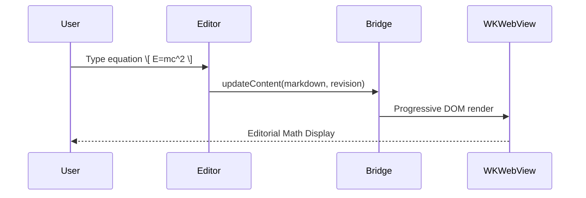

# Lucid Renderer Conformance & Torture-Test Fixture

This document is the canonical renderer conformance fixture for Lucid on macOS. It tests all supported Markdown, mathematical, diagrammatic, and structural syntax families in isolation and in complex mixed combinations.

---

## 1. Headings Hierarchy

# Heading Level 1 (H1)
## Heading Level 2 (H2)
### Heading Level 3 (H3)
#### Heading Level 4 (H4)
##### Heading Level 5 (H5)
###### Heading Level 6 (H6)

### Heading with `inline code` and **bold** and *italic*
### Heading with Unicode: Differential Equation $\frac{\partial u}{\partial t}$ & ∇·B = 0
### Duplicate Heading Name
### Duplicate Heading Name

---

## 2. Paragraphs & Line Breaks

This is a standard paragraph containing multiple sentences. It should wrap naturally to the content width defined by the active theme without overflow or awkward justification.

This is a second adjacent paragraph separated by a single blank line.

This paragraph tests a soft line break
where the text continues on the next line without creating a separate paragraph.

This paragraph tests a hard line break  
created by two trailing spaces, forcing an immediate newline.

---

## 3. Emphasis & Inline Formatting

- *Single asterisk italic* and _single underscore italic_
- **Double asterisk bold** and __double underscore bold__
- ***Triple asterisk bold italic*** and ___triple underscore bold italic___
- ~~Strikethrough text~~
- ==Highlighted text== (if extension enabled)
- Subscript: H~2~O and Superscript: E = mc^2^
- Escaped formatting: \*not italic\*, \_not italic\_, \*\*not bold\*\*

---

## 4. Horizontal Rules

Three asterisks:
***

Three hyphens:
---

Three underscores:
___

---

## 5. Lists & Task Lists

### 5.1 Unordered Lists
- Item with hyphen `-`
  * Nested item with asterisk `*`
    + Deeply nested item with plus `+`
      - Four levels deep

### 5.2 Ordered Lists
1. First ordered item
2. Second ordered item
   1. Nested ordered sub-item 2.1
   2. Nested ordered sub-item 2.2
3. Third ordered item with continuation paragraph:

   This is a continuation paragraph indented four spaces inside list item 3.

### 5.3 Task Lists
- [x] Completed task 1
- [ ] Incomplete task 2
  - [x] Nested completed task 2.1
  - [ ] Nested incomplete task 2.2

---

## 6. Blockquotes

> Standard single-level blockquote with editorial styling.
>
> Multiple paragraphs inside blockquote.

> Outer blockquote
> > Nested inner blockquote
> > > Deeply nested blockquote level 3

---

## 7. Links & Security

- Standard inline link: [Lucid Official Website](https://website-phi-umber-70.vercel.app)
- Autolink: <https://github.com/ajayuhjain89/lucid-macos>
- Mailto: <support@lucid.app>
- Link with complex URL parameters: [Complex Query](https://example.com/search?q=lucid+macos&category=tech#section_2)
- Internal anchor link: [Jump to Headings Hierarchy](#1-headings-hierarchy)
- Security test link (inert): [Disallowed Scheme Link](javascript:window.__lucidSecurityProbe=true)

---

## 8. Images

- Local/relative image: 
- Remote image: 

---

## 9. Inline Code

- Basic: `const pi = 3.14159;`
- Containing dollar signs: `$VAR` and `$$PROMPT$$`
- Containing backslashes & TeX commands: `\frac{a}{b}`, `\boxed{x}`, `\begin{matrix}`, `\Delta`
- Containing delimiters: `\(` and `\)` and `\[` and `\]`
- Containing backticks: `` `echo "code with backtick"` ``
- Critical Invariant: `\(\frac{a}{b}\)` must remain raw literal code without KaTeX rendering.

---

## 10. Fenced Code Blocks

### 10.1 Plain Text & Syntax Highlighted
```swift
import SwiftUI

struct ContentView: View {
    var body: some View {
        Text("Hello, Lucid!")
    }
}
```

```python
def calculate_transfer_function(num, den):
    """Compute polynomial transfer function roots."""
    return [r for r in roots(den)]
```

### 10.2 Four-Backtick Fence Regression (``` inside ````)
````markdown
```js
const x = "$not math$";
const y = "\[also not math\]";
```
````

### 10.3 Tilde Fence Regression (~~~~)
~~~~text
\[
E = mc^2 \text{ (inside tilde fence - must remain literal)}
\]
~~~~

---

## 11. GFM Tables

| Parameter | Symbol | Nominal Value | Units | Description |
| :--- | :---: | :---: | :--- | :--- |
| Open-loop Gain | $K_p$ | $12.5$ | V/V | Forward path amplification |
| Feedback Ratio | $\beta$ | $0.08$ | — | Sensor feedback coefficient |
| Natural Frequency | $\omega_n$ | $45.2$ | rad/s | Undamped system resonance |
| Damping Ratio | $\zeta$ | $0.707$ | — | Optimal Butterworth damping |
| Inline Display Math | Formula | \[\frac{1}{s^2+2\zeta\omega_n s+\omega_n^2}\] | s-domain | Second-order characteristic |

---

## 12. Standard Math Delimiters

### 12.1 Inline Math Delimiters
- Dollar inline: The energy relation is $E = mc^2$ in vacuum.
- Parenthesis inline: The frequency response is \(H(j\omega) = \frac{1}{1 + j\omega RC}\).

### 12.2 Display Math Delimiters
- Dollar display:
$$
\oint_{\partial \Sigma} \mathbf{B} \cdot d\mathbf{l} = \mu_0 I_{enc} + \mu_0 \varepsilon_0 \frac{d\Phi_E}{dt}
$$

- Bracket display:
\[
\mathcal{L}\{\ddot{y}(t)\} = s^2 Y(s) - s y(0) - \dot{y}(0)
\]

---

## 13. Multiline Display Equations & Alignment

### 13.1 Multiline Boxed Equation with Blank Lines
\[
\boxed{
\frac{C(s)}{R(s)}
=
\frac{G(s)}{1+G(s)H(s)}
}
\]

### 13.2 Aligned Equations
$$
\begin{aligned}
\dot{x}_1(t) &= -2x_1(t) + 4x_2(t) \\
\dot{x}_2(t) &= -x_1(t) - 3x_2(t) + u(t) \\
y(t) &= 2x_1(t) + x_2(t)
\end{aligned}
$$

---

## 14. KaTeX Command Coverage

### 14.1 Arithmetic & Fractions
\[
\frac{a + b}{c - d} + \frac{\frac{1}{x} + \frac{1}{y}}{\frac{1}{x} - \frac{1}{y}} = \frac{x + y}{y - x}
\]

### 14.2 Roots & Grouping
\[
\sqrt[3]{\frac{x^2 + y^2}{2\pi}} = \left[ \frac{\left( x + y \right)^2 - 2xy}{2\pi} \right]^{\frac{1}{3}}
\]

### 14.3 Greek Symbols & Text
\[
\alpha + \beta + \gamma + \Delta + \Theta + \lambda + \mu + \sigma + \omega + \Omega \quad \text{for all } t \ge 0
\]

### 14.4 Operators, Integrals & Sums
\[
\int_{-\infty}^{\infty} e^{-x^2} dx = \sqrt{\pi}, \quad \sum_{n=1}^{\infty} \frac{1}{n^2} = \frac{\pi^2}{6}, \quad \lim_{x \to 0} \frac{\sin x}{x} = 1
\]

### 14.5 Matrices & Cases
\[
\mathbf{A} = \begin{bmatrix}
a_{11} & a_{12} & \cdots & a_{1n} \\
a_{21} & a_{22} & \cdots & a_{2n} \\
\vdots & \vdots & \ddots & \vdots \\
a_{m1} & a_{m2} & \cdots & a_{mn}
\end{bmatrix}, \quad
f(x) = \begin{cases}
x^2 \sin\left(\frac{1}{x}\right) & x \neq 0 \\
0 & x = 0
\end{cases}
\]

---

## 15. Chemistry (`mhchem`)

\[
\ce{2H2 + O2 -> 2H2O}
\]

\[
\ce{LiCoO2 + 6C <=>[\text{charge}][\text{discharge}] Li_{1-x}CoO2 + Li_x C6}
\]

\[
\ce{^{238}_{92}U -> ^{234}_{90}Th + ^{4}_{2}\alpha}
\]

\[
\ce{SO4^2- + Ba^2+ -> BaSO4 v}
\]

---

## 16. Mermaid Diagrams

### 16.1 Flowchart LR


### 16.2 Sequence Diagram


---

## 17. GitHub-Style Callouts

> [!NOTE]
> This is a standard informational note callout.

> [!TIP]
> Use `⌘⌥T` to toggle the table-of-contents sidebar.

> [!IMPORTANT]
> The closed-loop transfer function is given by:
> \[
> T(s) = \frac{G(s)}{1 + G(s)H(s)}
> \]

> [!WARNING]
> High gain may drive the system poles into the right-half s-plane ($s > 0$).

> [!CAUTION]
> Unstable closed-loop feedback may cause physical actuator saturation.

> [!NOTE]+ Collapsible Alert (Expanded by Default)
> This content is inside an expandable details disclosure.

> [!TIP]- Collapsible Alert (Collapsed by Default)
> Hidden details revealed upon clicking the summary.

---

## 18. Raw HTML & Sanitization Policy

- Keyboard tag: Press <kbd>⌘</kbd> + <kbd>1</kbd> for Reader Mode.
- Sub/Sup: H<sub>2</sub>O and E = mc<sup>2</sup>
- Details/Summary:
<details>
<summary>Click for additional system specifications</summary>
Bandwidth: 100 MHz, Slew Rate: 50 V/µs, Input Impedance: 10 MΩ.
</details>

- Inert Security Probes:
<script>window.__lucidSecurityProbe = true;</script>


---

## 19. Unicode & International Text

- Greek characters: α β γ δ ε ζ η θ ι κ λ μ ν ξ ο π ρ σ τ υ φ χ ψ ω
- Mathematical operators: ≤ ≥ ≠ ± × ÷ ∞ → ← ↔ ⇒ ⇔ ≈ ≡ ∀ ∃ ∈ ∉ ⊂ ⊆ ∪ ∩
- Accented Latin: naïve café résumé façade Übergrößenträger
- CJK Characters: 現代制御工学 • 闭环控制系统 • 디지털 신호 처리
- Devanagari: नियंत्रण प्रणाली एवं गणितीय मॉडल
- Emoji: 🚀 ⚡️ 📐 🔬 📊

---

## 20. Escaping & Punctuation Edge Cases

- Literal backslashes: `\` and `\\`
- Escaped dollar: \$100 is not math
- Escaped brackets: \[not display math\] and \(not inline math\)
- Escaped asterisks and underscores: \*literal\* and \_literal\_
- Escaped pipe in text: \| not a table cell \|

---

## 21. Currency & Dollar Edge Cases

- Single price: The component costs $10.
- Multiple prices in sentence: The sensor costs $10 and the controller costs $20.
- High price: Total budget is $100.
- Range: Prices vary from $10 to $50.
- Legitimate dollar math:
  - $x$
  - $x+1$
  - $2x$
  - $100x + 20$
  - $x = 10$
  - The calculated value is $y = 2x + 1$.

---

## 22. Malformed Input Recovery

### 22.1 Unclosed Delimiters
$unclosed inline dollar

\(unclosed inline paren

\[
unclosed display bracket

### 22.2 Broken TeX Syntax
\[
\frac{NumeratorWithoutDenominator}{
\]

### 22.3 Subsequent Valid Expression (Must Render Correctly)
\[
E = mc^2
\]

---

## 23. Parser Boundary Torture Tests

### 23.1 Math to Heading
\[
E = mc^2
\]
# Heading Immediately Following Math

### 23.2 Heading to Math
# Heading Immediately Preceding Math
\[
E = mc^2
\]

### 23.3 Math to Horizontal Rule
\[
F = ma
\]
---

### 23.4 Math to List & List to Math
\[
V = IR
\]
1. First item
2. Second item
\[
P = VI
\]

### 23.5 Math to Code Fence & Fence to Math
\[
H(s) = \frac{1}{s+1}
\]
```python
x = 42
```
\[
G(s) = \frac{s}{s+2}
\]

### 23.6 Back-to-Back Display Equations
\[
E(s) = R(s) - B(s)
\]
\[
B(s) = H(s)C(s)
\]
\[
C(s) = G(s)E(s)
\]

### 23.7 Inline Math Beside Punctuation
The gain is \(G(s)=\frac{1}{s+1}\), **which is stable**.
The pole is at $s = -1$. Is the response overdamped? Yes!
Value: ($x = 5$).

---

## 24. Control Systems Regression Cases

### 24.1 Negative Feedback System Equations
\[
E(s)=R(s)-B(s)
\]

\[
B(s)=H(s)C(s)
\]

\[
C(s)=G(s)E(s)
\]

\[
C(s)=G(s)\left[R(s)-H(s)C(s)\right]
\]

\[
C(s)+G(s)H(s)C(s)=G(s)R(s)
\]

\[
C(s)\left[1+G(s)H(s)\right]=G(s)R(s)
\]

\[
\boxed{
\frac{C(s)}{R(s)}
=
\frac{G(s)}{1+G(s)H(s)}
}
\]

### 24.2 Positive Feedback Transfer Function
\[
\boxed{
\frac{C(s)}{R(s)}
=
\frac{G(s)}{1-G(s)H(s)}
}
\]

### 24.3 Mechanical System (Mass-Spring-Damper)
\[
F(t)=M\frac{d^2x(t)}{dt^2}
\]

\[
F(s)=Ms^2X(s)
\]

\[
\boxed{
\frac{X(s)}{F(s)}
=
\frac{1}{Ms^2}
}
\]

### 24.4 Spring Force Equation
\[
F(t)=Kx(t)
\]

\[
F(s)=KX(s)
\]

\[
\boxed{
\frac{X(s)}{F(s)}
=
\frac{1}{K}
}
\]

### 24.5 Rotational System Dynamics
\[
T(s)=\left(Js^2+Bs+K\right)\Theta(s)
\]

\[
\boxed{
\frac{\Theta(s)}{T(s)}
=
\frac{1}{Js^2+Bs+K}
}
\]

### 24.6 RLC Electrical Circuit
\[
v(t)=Ri(t)+L\frac{di(t)}{dt}+\frac{1}{C}\int i(t)\,dt
\]

### 24.7 Mason's Gain Formula & Inline Subscripts
\[
\Delta
=
1-\sum_i L_i
+\sum_{i,j}L_iL_j
-\sum_{i,j,k}L_iL_jL_k
+\cdots
\]

The individual forward path gains are \(P_k\) and the cofactor determinants are \(\Delta_k\).

---

## 25. Complex Mixed Constructs

### 25.1 Blockquote + Ordered List + Display Math
> **Example: Transfer Function Derivation**
>
> 1. Formulate the loop transfer function:
>
>    \[
>    G(s)=\frac{1}{s^2+2s+1}
>    \]
>
> 2. Determine the inline pole locations: \(s_{1,2} = -1\).

### 25.2 Callout + Math
> [!IMPORTANT]
> Closed-loop transfer function:
>
> \[
> \frac{C(s)}{R(s)}
> =
> \frac{G(s)}{1+G(s)H(s)}
> \]

### 25.3 List + Inline Code + Display Math
1. Governing equation:
   \[
   E = mc^2
   \]
2. Equivalent Swift implementation:
   `let energy = mass * speedOfLight * speedOfLight`

### 25.4 Table + Display & Inline Math
| Component | Function | S-domain Expression |
| :--- | :--- | :--- |
| Plant | Forward transfer | \(G(s) = \frac{K}{s(s+2)}\) |
| Feedback | Sensor dynamics | \(H(s) = \frac{1}{1 + 0.05s}\) |
| System | Closed-loop response | \[\frac{C(s)}{R(s)} = \frac{G(s)}{1+G(s)H(s)}\] |

---

## 26. Large Document / Performance Stress Section

### Paragraphs & Equations Repeated for Scale
Paragraph 1: The root locus technique sketches the trajectories of closed-loop poles in the complex s-plane as a system parameter varies from zero to infinity. When $K > 0$, the roots start at the open-loop poles and terminate at the open-loop zeros.

\[
1 + K \frac{s+3}{s(s+1)(s+2)} = 0
\]

Paragraph 2: Frequency response methods represent sinusoidal steady-state behavior across all frequencies $\omega \in [0, \infty)$. The Bode plot displays magnitude in decibels and phase in degrees versus logarithmic frequency.

\[
M(\omega) = |G(j\omega)| = \frac{1}{\sqrt{(1 - \omega^2)^2 + (2\zeta\omega)^2}}
\]

Paragraph 3: Nyquist stability criterion maps the right-half s-plane contour into the complex $G(s)H(s)$ plane. The number of clockwise encirclements of the critical point $-1 + j0$ determines stability.

\[
Z = N + P
\]
